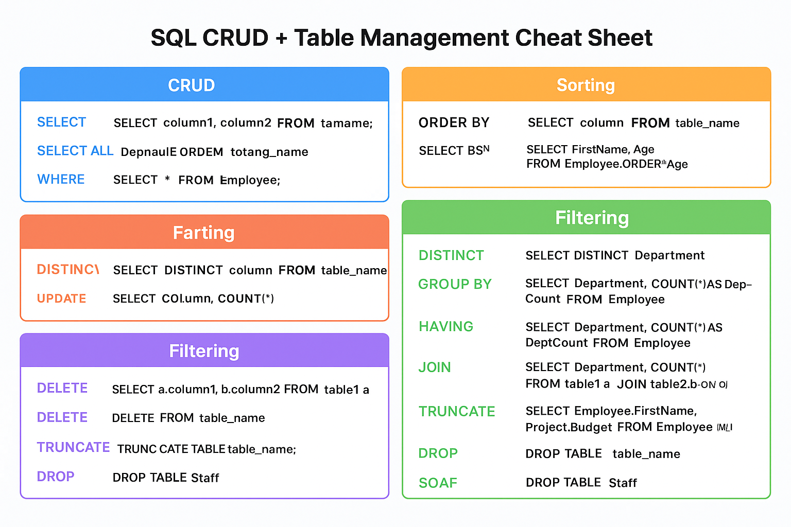

# SQL For Data Analysis

A concise, well-formatted reference for common SQL concepts, commands, and examples.

---

## Table of Contents
- Overview
- SQL Command Categories
- CREATE DATABASE & CREATE TABLE
- INSERT INTO examples
- ALTER TABLE examples
- SELECT / CRUD examples
- Quick Reference Cheat Sheet
- ER Diagram (script)
- Command Sheet (image)

---

## Overview
SQL (Structured Query Language) is the standard language for working with relational databases. Use it to create structures (DDL), manipulate data (DML), query data (DQL), control transactions (TCL), and manage permissions (DCL).

---

## SQL Command Categories
| Category | Description |
|---|---|
| DDL (Data Definition Language) | Create/modify/delete database objects (CREATE, DROP, ALTER, TRUNCATE) |
| DML (Data Manipulation Language) | Insert/update/delete data (INSERT, UPDATE, DELETE) |
| DQL (Data Query Language) | Query data (SELECT) |
| TCL (Transaction Control Language) | Transaction control (COMMIT, ROLLBACK, SAVEPOINT) |
| DCL (Data Control Language) | Permission control (GRANT, REVOKE) |

---

## Common Commands (Examples)

### DDL
```sql
-- Create a database
CREATE DATABASE SchoolDB;

-- Create a table
CREATE TABLE Students (
    StudentID INT PRIMARY KEY,
    Name VARCHAR(100) NOT NULL,
    Age INT,
    Grade CHAR(1)
);
```

### DML
```sql
-- Insert rows
INSERT INTO Students (StudentID, Name, Age, Grade)
VALUES (1, 'Alice', 20, 'A');

-- Update rows
UPDATE Students SET Age = 21 WHERE StudentID = 1;

-- Delete rows
DELETE FROM Students WHERE StudentID = 1;
```

### TCL
```sql
BEGIN;
-- some DML...
SAVEPOINT sp1;
-- more DML...
ROLLBACK TO sp1;
COMMIT;
```

### DCL
```sql
GRANT SELECT, INSERT ON Students TO user1;
REVOKE INSERT ON Students FROM user1;
```

---

## CREATE TABLE — Examples

Simple table:
```sql
CREATE TABLE Courses (
    CourseID INT PRIMARY KEY,
    CourseName VARCHAR(50) NOT NULL UNIQUE,
    Credits INT CHECK (Credits > 0),
    Department VARCHAR(30) DEFAULT 'General'
);
```

Table with foreign keys:
```sql
CREATE TABLE Enrollments (
    EnrollmentID INT PRIMARY KEY,
    StudentID INT,
    CourseID INT,
    EnrollmentDate DATE,
    FOREIGN KEY (StudentID) REFERENCES Students(StudentID),
    FOREIGN KEY (CourseID) REFERENCES Courses(CourseID)
);
```

---

## INSERT INTO — Examples

Insert into all columns:
```sql
INSERT INTO Students VALUES (1, 'Alice', 20, 'A');
```

Insert into specific columns:
```sql
INSERT INTO Students (StudentID, Name) VALUES (2, 'Bob');
```

Insert multiple rows:
```sql
INSERT INTO Students (StudentID, Name, Age, Grade) VALUES
  (3, 'Charlie', 22, 'B'),
  (4, 'Diana', 21, 'A');
```

Insert from another table:
```sql
INSERT INTO Alumni (StudentID, Name)
SELECT StudentID, Name FROM Students WHERE Grade = 'A';
```

---

## ALTER TABLE — Examples
```sql
-- Add a column
ALTER TABLE Students ADD Email VARCHAR(100);

-- Modify column (MySQL)
ALTER TABLE Students MODIFY Age BIGINT;

-- Drop column
ALTER TABLE Students DROP COLUMN Grade;

-- Rename column (dialect may vary)
ALTER TABLE Students RENAME COLUMN Name TO FullName;

-- Rename table (dialect may vary)
ALTER TABLE Students RENAME TO Learners;
```

---

## SELECT / CRUD Examples

Sample Employee table:
```sql
CREATE TABLE Employee (
    EmpID INT PRIMARY KEY,
    FirstName VARCHAR(50),
    LastName VARCHAR(50),
    Department VARCHAR(50),
    Age INT,
    PhoneNo VARCHAR(10)
);
```

Basic SELECT:
```sql
SELECT FirstName, LastName FROM Employee;
SELECT * FROM Employee;
```

WHERE / ORDER BY / DISTINCT / GROUP BY / HAVING / JOIN:
```sql
SELECT FirstName, Age FROM Employee WHERE Age = 25;
SELECT FirstName, Age FROM Employee ORDER BY Age DESC;
SELECT DISTINCT Department FROM Employee;
SELECT Department, COUNT(*) AS EmployeeCount FROM Employee GROUP BY Department;
SELECT Department, COUNT(*) FROM Employee GROUP BY Department HAVING COUNT(*) >= 2;
SELECT e.FirstName, p.Budget
FROM Employee e
JOIN Project p ON e.EmpID = p.EmpID;
```

UPDATE / DELETE:
```sql
UPDATE Staff SET PhoneNo = '9999999999' WHERE FirstName = 'Amelia';
DELETE FROM Staff WHERE Department = 'Marketing';
```

DROP / TRUNCATE:
```sql
DROP TABLE Staff;
TRUNCATE TABLE Staff;
```

---

## Quick Reference Cheat Sheet

| Statement | Purpose |
|---|---|
| SELECT | Retrieve rows |
| INSERT | Add rows |
| UPDATE | Modify rows |
| DELETE | Remove rows |
| CREATE TABLE | Define a table |
| ALTER TABLE | Change table structure |
| DROP TABLE | Remove table |
| TRUNCATE TABLE | Remove all rows (faster) |
| JOIN | Combine tables on keys |
| GROUP BY / HAVING | Aggregate and filter groups |
| ORDER BY | Sort results |

---

## ER Diagram Script (Python)
Use this script to generate a simple ER visualization (requires networkx & matplotlib).
```python
# python
import matplotlib.pyplot as plt
import networkx as nx

tables = {
    "Students": ["StudentID (PK)", "Name", "Age", "Grade"],
    "Courses": ["CourseID (PK)", "CourseName", "Credits", "Department"],
    "Enrollments": ["EnrollmentID (PK)", "StudentID (FK)", "CourseID (FK)", "EnrollmentDate"]
}

relationships = [
    ("Enrollments", "Students"),
    ("Enrollments", "Courses")
]

G = nx.DiGraph()
for table, columns in tables.items():
    label = f"{table}\n" + "\n".join(columns)
    G.add_node(table, label=label)
G.add_edges_from(relationships)

pos = nx.spring_layout(G, seed=42)
plt.figure(figsize=(10,6))
nx.draw_networkx_nodes(G, pos, node_size=3500, node_color="lightblue", edgecolors="black")
nx.draw_networkx_edges(G, pos, arrowstyle="->", arrowsize=20)
labels = nx.get_node_attributes(G, "label")
nx.draw_networkx_labels(G, pos, labels, font_size=9, font_family="monospace")

plt.title("ER Diagram: SchoolDB", fontsize=14)
plt.axis("off")
plt.show()
```

---

## Command Sheet


---

### Detailed: ALTER TABLE
Notes: Some dialects differ — MySQL uses MODIFY, SQL Server/Oracle use ALTER COLUMN.

```sql
-- Add a column
ALTER TABLE Students ADD Email VARCHAR(100);

-- MySQL: change datatype
ALTER TABLE Students MODIFY Age BIGINT;

-- SQL Server / Oracle: change datatype
ALTER TABLE Students ALTER COLUMN Age BIGINT;

-- Drop a column
ALTER TABLE Students DROP COLUMN Grade;

-- Rename a column (dialect-specific)
-- PostgreSQL:
ALTER TABLE Students RENAME COLUMN Name TO FullName;

-- Rename table (dialect-specific)
ALTER TABLE Students RENAME TO Learners;
```

Quick summary:
| Operation | MySQL | SQL Server / Oracle | PostgreSQL |
|---|---:|---:|---:|
| Modify column type | ALTER TABLE ... MODIFY | ALTER TABLE ... ALTER COLUMN | ALTER TABLE ... ALTER COLUMN |
| Rename column | ALTER TABLE ... CHANGE (older) / RENAME COLUMN | sp_rename or ALTER TABLE ... ALTER COLUMN (varies) | ALTER TABLE ... RENAME COLUMN |
| Rename table | RENAME TABLE / ALTER TABLE ... RENAME | sp_rename | ALTER TABLE ... RENAME TO |

---

### SQL SELECT — Full examples with sample data

Create sample Employee and Project tables and insert data:
```sql
CREATE TABLE Employee (
    EmpID INT PRIMARY KEY,
    FirstName VARCHAR(50),
    LastName VARCHAR(50),
    Department VARCHAR(50),
    Age INT,
    ContactNo VARCHAR(10)
);

INSERT INTO Employee (EmpID, FirstName, LastName, Department, Age, ContactNo) VALUES
(101, 'Ethan', 'Brown',  'Finance',   28, '9876543210'),
(102, 'Olivia','Wilson', 'HR',        25, '9876543211'),
(103, 'Hiro',  'Yamamoto','IT',       30, '9876543212'),
(104, 'Miguel','Garcia', 'Finance',   25, '9876543213'),
(105, 'Sofia', 'Bianchi', 'Marketing', 27, '9876543214');

CREATE TABLE Project (
    ProjectID INT PRIMARY KEY,
    EmpID INT,
    Budget DECIMAL(10,2),
    FOREIGN KEY (EmpID) REFERENCES Employee(EmpID)
);

INSERT INTO Project (ProjectID, EmpID, Budget) VALUES
(201, 101, 50000.00),
(202, 102, 30000.00),
(203, 103, 70000.00);
```

Select examples:
```sql
-- Specific columns
SELECT FirstName, LastName FROM Employee;

-- All columns
SELECT * FROM Employee;

-- Filter
SELECT FirstName, Age FROM Employee WHERE Age = 25;

-- Order by
SELECT FirstName, Age FROM Employee ORDER BY Age DESC;

-- Distinct
SELECT DISTINCT Department FROM Employee;

-- Group / Having
SELECT Department, COUNT(*) AS EmployeeCount FROM Employee GROUP BY Department;
SELECT Department, COUNT(*) AS EmployeeCount FROM Employee GROUP BY Department HAVING COUNT(*) >= 2;

-- Join
SELECT e.FirstName, p.Budget
FROM Employee e
JOIN Project p ON e.EmpID = p.EmpID;
```

Expected sample outputs (rendered as simple Markdown tables):

Employees (selected columns)
| EmpID | FirstName | LastName | Department | Age | ContactNo |
|---:|---|---|---|---:|---|
| 101 | Ethan  | Brown   | Finance   | 28 | 9876543210 |
| 102 | Olivia | Wilson  | HR        | 25 | 9876543211 |
| 103 | Hiro   | Yamamoto| IT        | 30 | 9876543212 |
| 104 | Miguel | Garcia  | Finance   | 25 | 9876543213 |
| 105 | Sofia  | Bianchi | Marketing | 27 | 9876543214 |

Employees aged 25
| FirstName | Age |
|---|---:|
| Olivia | 25 |
| Miguel | 25 |

Employee — Project join
| FirstName | Budget |
|---|---:|
| Ethan  | 50000.00 |
| Olivia | 30000.00 |
| Hiro   | 70000.00 |

---

### WHERE / ORDER BY / GROUP BY / HAVING / JOIN — quick notes
- WHERE filters rows before grouping.
- GROUP BY groups rows; use aggregate functions (COUNT, SUM, AVG).
- HAVING filters groups (use after GROUP BY).
- ORDER BY sorts final result (ASC default, use DESC for reverse).
- JOIN types: INNER JOIN (matching rows), LEFT/RIGHT JOIN (preserve one side), FULL OUTER JOIN (both sides).

---

### CRUD & Table Management Cheat Sheet (cleaned)
| Statement | Purpose | Notes |
|---|---|---|
| SELECT | Retrieve rows | Use WHERE to filter |
| INSERT | Add rows | Specify columns to avoid ordering issues |
| UPDATE | Modify rows | Always include WHERE to avoid full-table updates |
| DELETE | Remove rows | Always include WHERE to avoid full-table deletes |
| CREATE TABLE | Define a table | Define primary/foreign keys, constraints |
| ALTER TABLE | Change table structure | Dialect differences for MODIFY/ALTER COLUMN |
| DROP TABLE | Remove table and data | Irrecoverable without backup |
| TRUNCATE TABLE | Remove all rows fast | Resets storage; cannot be rolled back in some DBs |
| JOIN | Combine tables | Use ON to define join condition |
| GROUP BY / HAVING | Aggregate and filter groups | HAVING filters aggregated results |
| ORDER BY | Sort results | Use ASC or DESC |

---

### Common pitfalls & tips
- Always test ALTER and DROP in a staging DB before production.
- Use transactions (BEGIN/COMMIT/ROLLBACK) for grouped DML operations.
- Prefer explicit column lists in INSERT statements.
- Use indexes on frequently joined/filtered columns for performance.

---

## Contributing
Contributions are welcome! Please open issues or submit pull requests for improvements.


## Contact
For questions or collaboration, contact [Devnath03](https://github.com/Devnath03).

